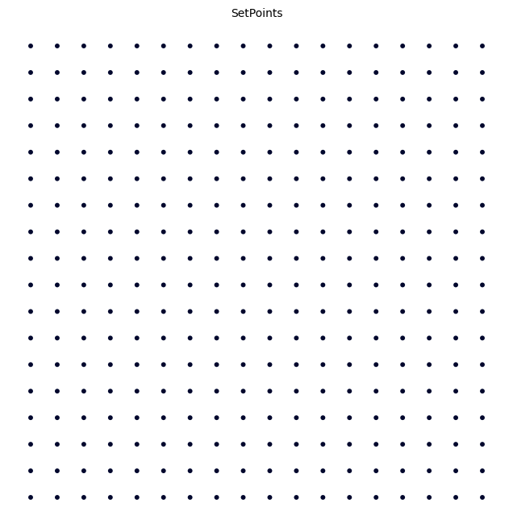

# grid

Generates a regular 2D grid of points.

The points form a 2D grid with integer coordinates. The `shape` parameter is a tuple (n_x, n_y) defining the number of steps along each axis.

Coordinates are integers on each axis:
- x ∈ {0, 1, ..., n_x}
- y ∈ {0, 1, ..., n_y}

Uses numpy.arange(0, n_i + 1), then builds all combinations with meshgrid.
## Parameters

- `shape` (tuple of int):  A tuple (n_x, n_y). Only 2D grids are supported.

## Returns

- `SetPoints`: Instance with points of shape ((n_x+1)*(n_y+1), 2).

## Example

```python
from pathlib import Path
import proximitygraphs as pg

images = Path("images")
images.mkdir(parents=True, exist_ok=True)

pts = pg.SetPoints.grid(shape=(18, 18))

# Save: images/grid.png
pts.draw(save=str(images / "grid"), figsize=(8, 8), v_color='#ff7f0e', v_size=18)
```



