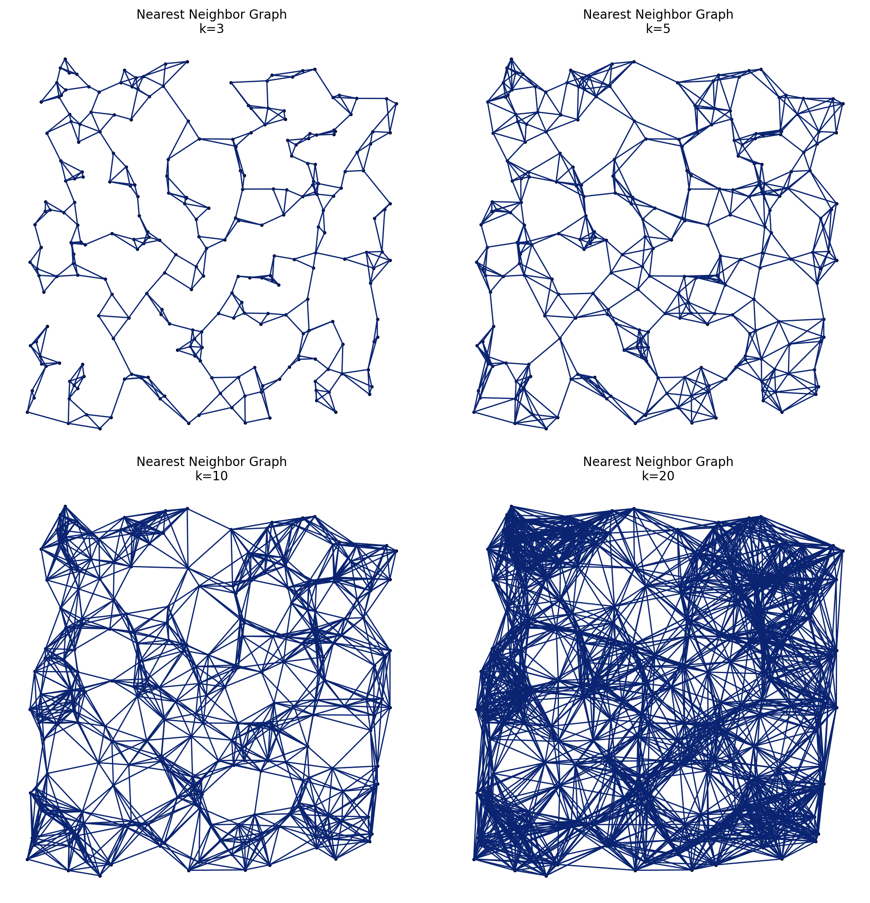

# NNG (k-nearest neighbor graph)

Connects each point to its k nearest neighbors.

## Constructor

```python
NNG(setpoints, k=1)
```

**Parameters:**
- **setpoints** (SetPoints): The set of points.
- **k** (int): Number of nearest neighbors (must be $1 \leq k < n$).

## Mathematical Definition:

For each point $p \in P$, let $N_k(p)$ denote the $k$ nearest neighbors of $p$ (excluding $p$ itself). The k-nearest neighbors graph is:

$$\text{k-NNG}(P, k) = \{(p, q) : q \in N_k(p) \text{ or } p \in N_k(q)\}$$

Note: This is typically a directed graph, but this implementation creates undirected edges (symmetric).

The distance to the k-th nearest neighbor of $p$ is:

$$d_k(p) = \min\{r : |B(p, r) \cap P| \geq k + 1\}$$

where $B(p, r) = \{q \in P : \|q - p\| \leq r\}$.

**Properties:**
- Always has at least $kn/2$ edges (if symmetric)
- Graph is typically connected for $k \geq \log n$
- Can have up to $kn$ directed edges
- Useful for clustering and manifold learning
- Can be computed in $O(n \log n)$ using kd-trees

**Value Errors:**
- Raises `ValueError` if $k < 1$ or $k \geq n$
- Raises `TypeError` if `k` is not an integer

## Example

```python
from pathlib import Path
import proximitygraphs as pg

images = Path("images")
images.mkdir(parents=True, exist_ok=True)

pts = pg.SetPoints.uniform_square(n=250, seed=42)

# Save the point set used in the example
pts.draw(save=str(images / "knn_points"), figsize=(6, 6), details=True)

G3  = pg.NNG(pts, k=3)
G5  = pg.NNG(pts, k=5)
G10 = pg.NNG(pts, k=10)
G20 = pg.NNG(pts, k=20)

graphs = [G3, G5, G10, G20]

fig, _axs = pg.draw_grid(graphs, 2, 2, figsize=(10, 10), details=True)
fig.savefig(images / "knn.png", dpi=200, bbox_inches="tight")
```




