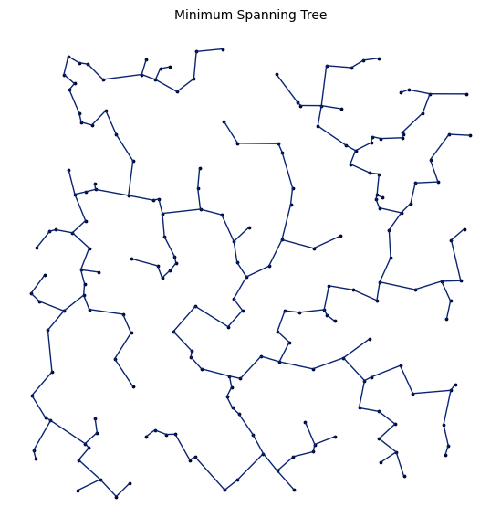

# Minimum Spanning Tree (MST)

Constructs the Euclidean Minimum Spanning Tree.

The MST connects all vertices with minimum total edge length, without cycles.

## Constructor

```python
MST(setpoints)
```

**Parameters:**
- **setpoints** (SetPoints): The set of points.

### Mathematical Definition:

For a complete graph $K_n$ with edge weights $w(p_i, p_j) = \|p_i - p_j\|$ (Euclidean distance), the MST is a spanning tree $T = (V, E_T)$ such that:

$$\sum_{e \in E_T} w(e) = \min_{T' \text{ spanning}} \sum_{e \in T'} w(e)$$

Properties:
- $|E_T| = n - 1$ (exactly $n-1$ edges for $n$ vertices)
- Acyclic and connected
- Subgraph of the Delaunay triangulation in Euclidean spaces
- Can be computed using Kruskal's or Prim's algorithm in $O(m \log m)$ time

The MST satisfies: MST $\subseteq$ RNG $\subseteq$ GG $\subseteq$ DT

**Value Errors:**
- Requires at least 2 points
- Raises `ValueError` if `setpoints` contains fewer than 2 points

## Example

```python
from pathlib import Path
import proximitygraphs as pg

images = Path("images")
images.mkdir(parents=True, exist_ok=True)

pts = pg.SetPoints.uniform_square(n=200, seed=42)

# Save the point set used in the example
pts.draw(save=str(images / "mst_points"), figsize=(6, 6), details=True)

G = pg.MST(pts)

graphs = [G]

fig, _axs = pg.draw_grid(graphs, 1, 1, figsize=(7, 7), details=True)
fig.savefig(images / "mst.png", dpi=200, bbox_inches="tight")
```




