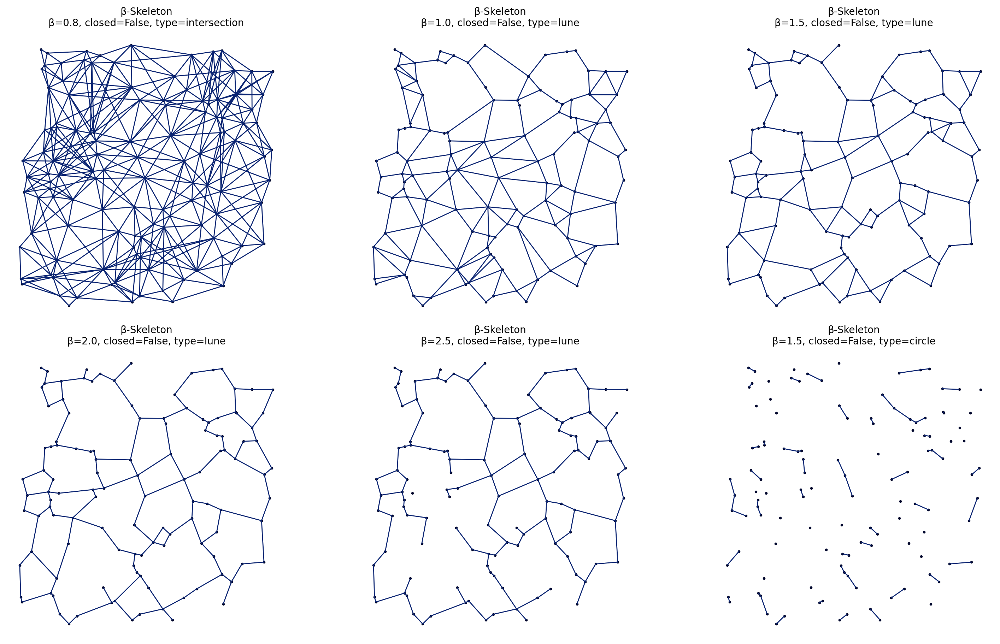

# Class: Beta_Skeleton

A parameterized family of proximity graphs where β controls the neighborhood shape.

## Constructor

```python
Beta_Skeleton(setpoints, beta=1.5, type_region="lune", closed=False)
```

**Parameters:**
- **setpoints** (SetPoints): The set of points.
- **beta** (float): The β parameter (must be $\beta > 0$).
  - $\beta < 1$: Intersection of circles (requires type_region="intersection")
  - $\beta = 1$: Gabriel Graph (lune or circle)
  - $1 < \beta < 2$: Intermediate lune-shaped regions
  - $\beta = 2$: Relative Neighborhood Graph
  - $\beta > 2$: Stricter than RNG
  
- **type_region** (str): Region type:
  - "lune": Lune-shaped region (default for $\beta \geq 1$)
  - "circle": Circular region (for $\beta \geq 1$)
  - "intersection": Intersection of circles (for $\beta < 1$)
- **closed** (bool): If True, uses $\leq$ (closed region). If False, uses $<$ (open region).

## Mathematical Definition:

For two points $p, q \in P$, the edge $(p, q)$ is in $\text{BS}_\beta(P)$ if the lune-shaped region $L_\beta(p, q)$ contains no other points from $P$.

**Lune Region ($\beta \geq 1$):**

$$L_\beta(p, q) = B\left(\frac{p + q}{2} + \frac{\beta}{2}n, \frac{\beta \|p-q\|}{2}\right) \cap B\left(\frac{p + q}{2} - \frac{\beta}{2}n, \frac{\beta \|p-q\|}{2}\right)$$

where $n$ is the unit normal to $\overrightarrow{pq}$ and $B(c, r)$ is a ball of radius $r$ centered at $c$.

**Circle Region ($\beta \geq 1$):**

$$C_\beta(p, q) = B\left(\frac{p + q}{2}, \frac{\beta \|p-q\|}{2}\right)$$

**Intersection Region ($\beta < 1$):**

$$I_\beta(p, q) = B(p, \beta \|p-q\|) \cap B(q, \beta \|p-q\|)$$

The edge $(p, q)$ exists if:

$$L_\beta(p, q) \cap P = \{p, q\} \quad \text{(for closed=False)}$$
$$L_\beta(p, q) \cap P \subseteq \{p, q\} \quad \text{(for closed=True)}$$

**Special Cases:**
- $\beta = 1, \text{lune}$: Gabriel Graph
- $\beta = 2, \text{lune}$: Relative Neighborhood Graph
- $\beta \to 0$: Approaches [Delaunay triangulation](delaunay)
- $\beta \to \infty$: Approaches nearest neighbor graph

**Value Errors:**
- Raises `ValueError` if $\beta \leq 0$
- Raises `ValueError` if `type_region` not in `["lune", "circle", "intersection"]`
- Raises `ValueError` if $\beta < 1$ and `type_region != "intersection"`
- Raises `TypeError` if `closed` is not a boolean

## Example

```python
from pathlib import Path
import proximitygraphs as pg

images = Path("images")
images.mkdir(parents=True, exist_ok=True)

pts = pg.SetPoints.uniform_square(n=120, seed=42)

# Save the point set used in the example
pts.draw(save=str(images / "beta_skeleton_points"), figsize=(6, 6), details=True)

B08 = pg.Beta_Skeleton(pts, beta=0.8, type_region="intersection", closed=False)
B10 = pg.Beta_Skeleton(pts, beta=1.0, type_region="lune", closed=False)
B15 = pg.Beta_Skeleton(pts, beta=1.5, type_region="lune", closed=False)
B20 = pg.Beta_Skeleton(pts, beta=2.0, type_region="lune", closed=False)
B25 = pg.Beta_Skeleton(pts, beta=2.5, type_region="lune", closed=False)
B15c = pg.Beta_Skeleton(pts, beta=1.5, type_region="circle", closed=False)

graphs = [B08, B10, B15, B20, B25, B15c]

fig, _axs = pg.draw_grid(graphs, 2, 3, figsize=(15, 9), details=True)
fig.savefig(images / "beta_skeleton.png", dpi=200, bbox_inches="tight")
```



## Class Method: from_graph

```python
Beta_Skeleton.from_graph(geom_graph, beta=1.5, type_region="lune", closed=False)
```

Constructs a β-skeleton using an existing graph's edges as candidates.

**Parameters:**
- **geom_graph** (GeometricGraph): Base graph providing edge candidates
- **beta** (float): The β parameter (must be $> 0$)
- **type_region** (str): Region type
- **closed** (bool): Region closure

**Returns:**
- **Beta_Skeleton**: A new β-skeleton graph

## Mathematical Definition:

Given a graph $G = (V, E)$, constructs $\text{BS}_\beta(V)$ by testing only edges in $E$ rather than all $\binom{n}{2}$ pairs:

$$\text{BS}_\beta^G(P) = \{(p, q) \in E : L_\beta(p, q) \cap P \subseteq \{p, q\}\}$$

This is much faster when $|E| \ll \binom{n}{2}$, such as when $G$ is the Delaunay triangulation.

**Value Errors:**
- Same as constructor
- Raises `TypeError` if `geom_graph` is not a `GeometricGraph`

## Example:

```python
from proximitygraphs.points import SetPoints
from proximitygraphs.proximitygraphs import Beta_Skeleton, DelaunayG

points = SetPoints.uniform_square(n=200, seed=42)

# Compute from all pairs (slow for large n)
# beta_all = Beta_Skeleton(points, beta=1.5)

# Fast: use Delaunay edges as candidates
delaunay = DelaunayG(points)
beta_fast = Beta_Skeleton.from_graph(delaunay, beta=1.5, type_region="lune")

print(f"β-skeleton from Delaunay: {beta_fast.m} edges")
print(f"Delaunay edges tested: {delaunay.m} (vs {200*199//2} all pairs)")
# Massive speedup for large point sets!
```


