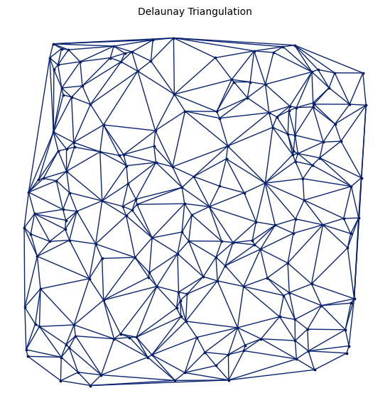

# Delaunay Triangulation


Constructs the Delaunay triangulation of a point set.

The Delaunay triangulation DT(P) has the "empty circle" property: no point in P is inside the circumcircle of any triangle.

## Constructor

```python
DelaunayG(setpoints)
```

**Parameters:**
- **setpoints** (SetPoints): The set of points to triangulate (must be in $\mathbb{R}^d$ where $d \geq 2$).

### Mathematical Definition:

For a set of points $P = \{p_1, p_2, \ldots, p_n\} \subset \mathbb{R}^d$, the Delaunay triangulation $\text{DT}(P)$ is a triangulation where for every simplex $S \in \text{DT}(P)$:

$$\text{circumball}(S) \cap P = \text{vertices}(S)$$

This is the "empty circumsphere" property. For each triangle with vertices $(p_i, p_j, p_k)$, the circumcircle $C(p_i, p_j, p_k)$ satisfies:

$$\forall p_\ell \in P \setminus \{p_i, p_j, p_k\}: \|p_\ell - c\| \geq r$$

where $c$ is the circumcenter and $r$ is the circumradius.

**Properties:**
- Maximizes the minimum angle of all triangles (among all triangulations)
- Unique for points in general position (no four points are cocircular)
- Dual of the Voronoi diagram
- Contains exactly $\binom{n}{2}$ edges for $n$ points in convex position

**Value Errors:**
- Raises `ValueError` if fewer than $d + 1$ points are provided (minimum for a simplex in dimension $d$)
- Raises `QhullError` if points are degenerate (e.g., all collinear in 2D)

## Example

```python
from pathlib import Path
import proximitygraphs as pg

images = Path("images")
images.mkdir(parents=True, exist_ok=True)

pts = pg.SetPoints.uniform_square(n=200, seed=42)

# Save the point set used in the example
pts.draw(save=str(images / "delaunay_points"), figsize=(6, 6), details=True)

G = pg.DelaunayG(pts)

graphs = [G]

fig, _axs = pg.draw_grid(graphs, 1, 1, figsize=(7, 7), details=True)
fig.savefig(images / "delaunay.png", dpi=200, bbox_inches="tight")
```




