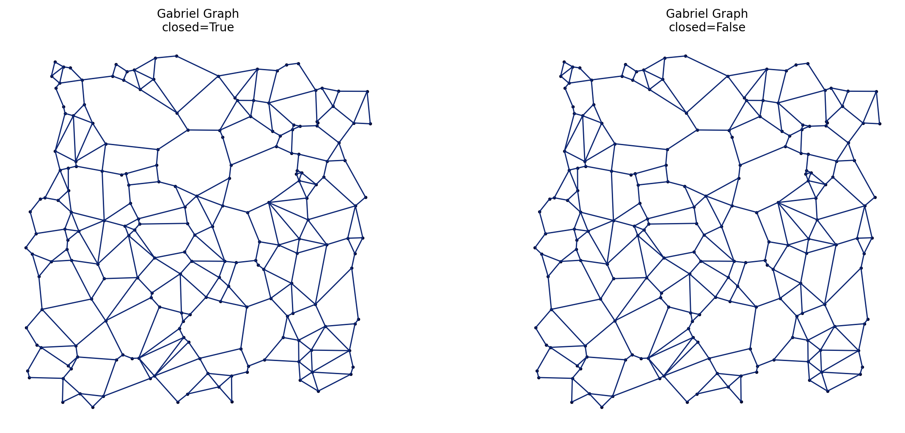

# Gabriel Graph

The Gabriel Graph is a β-skeleton with β=1.

Two points p and q are connected if the circle with diameter pq contains no other points.

## Constructor

```python
GG(setpoints, closed=True)
```

**Parameters:**
- **setpoints** (SetPoints): The set of points.
- **closed** (bool): If True (default), uses $\leq$. If False, uses $<$.

## Mathematical Definition: 

The Gabriel Graph $\text{GG}(P)$ contains edge $(p, q)$ if and only if the closed ball with diameter $\overline{pq}$ is empty:

$$\text{GG}(P) = \left\{(p, q) : B\left(\frac{p+q}{2}, \frac{\|p-q\|}{2}\right) \cap P \subseteq \{p, q\}\right\}$$

Equivalently, $(p, q) \in \text{GG}(P)$ if:

$$\forall r \in P \setminus \{p, q\}: \|r - p\|^2 + \|r - q\|^2 \geq \|p - q\|^2$$

This is the "empty diametral circle" property.

**Properties:**
- Subgraph of the Delaunay triangulation: $\text{GG}(P) \subseteq \text{DT}(P)$
- Supergraph of RNG and MST: $\text{MST}(P) \subseteq \text{RNG}(P) \subseteq \text{GG}(P)$
- Important in wireless sensor networks (models direct communication)
- Typically has $O(n)$ edges
- Can be computed in $O(n \log n)$ time via Delaunay

**Value Errors:**
- Raises `TypeError` if `closed` is not boolean
- Requires at least 2 points

## Example

```python
from pathlib import Path
import proximitygraphs as pg

images = Path("images")
images.mkdir(parents=True, exist_ok=True)

pts = pg.SetPoints.uniform_square(n=200, seed=42)

# Save the point set used in the example
pts.draw(save=str(images / "gabriel_graph_points"), figsize=(6, 6), details=True)

G_closed = pg.GG(pts, closed=True)
G_open   = pg.GG(pts, closed=False)

graphs = [G_closed, G_open]

fig, _axs = pg.draw_grid(graphs, 1, 2, figsize=(12, 5), details=True)
fig.savefig(images / "gabriel_graph.png", dpi=200, bbox_inches="tight")
```




