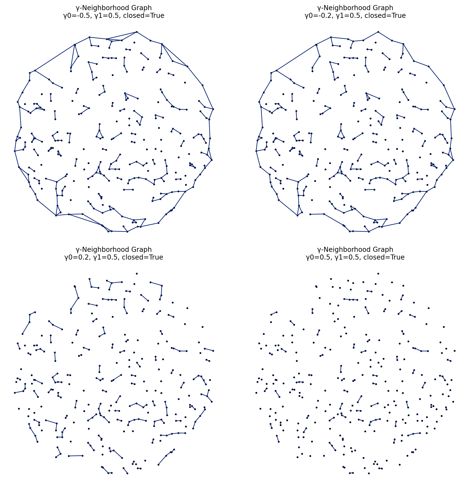

# Gamma_Graph

## Overview

`Gamma_Graph` implements the **2D γ-neighborhood graph** (Veltkamp, 1992), a two-parameter family of proximity graphs that interpolates between classic geometric graphs (e.g., Gabriel graph, convex-hull graph) by varying the **empty-neighborhood** used to decide whether an edge exists.

> “...unifies ... into a continuous spectrum of geometric graphs that ranges from the void to the complete graph.”  fileciteturn3file3L13-L16

This implementation follows the neighborhood-emptiness principle: an undirected edge `(i, j)` is included if the γ-neighborhood of points `p_i, p_j` contains at most `k` other points.

## Figures

The examples below generate the same figures that are embedded here.





---

## Mathematical definition (2D)

### Notation

- Point set: `S = {p_1, …, p_n} ⊂ ℝ²` with Euclidean norm `‖·‖`.
- For a candidate pair `(p,q)`, define segment length `L = ‖p-q‖` and half-length `r = L/2`.
- Parameters:
  - `gamma0 ∈ (-1, 1)` controls **radius scale**.
  - `gamma1 ∈ (-1, 1)` controls **intersection vs union** (and, in the planar case, the “side” selection).
  - `k ∈ {0,1,2,…}` is the allowed number of interior points (“k-relaxation”).
  - `closed ∈ {True, False}` chooses `≤` vs `<` in the interior test.

### γ-neighborhood as intersection/union of two discs

Veltkamp defines the γ-neighborhood (written **y-neighborhood** in the paper) as either an **intersection** or a **union** of two objects `B_{y}` (spheres/half-spaces) depending on the sign of the second parameter. In particular, for the two-site (planar) case, the neighborhood uses two circles/half-planes through `p` and `q`, and takes intersection if `gamma1 ≤ 0` and union if `gamma1 ≥ 0`. fileciteturn2file0L254-L269

In the **finite-radius** planar case (`|gamma0|<1`), the circles used in the construction have radius

```
R = r / (1 - |gamma0|)   with   r = ‖p-q‖/2 .
```

Their centers lie on the perpendicular bisector of segment `pq` at distance

```
B = √(R² - r²)
```

from the midpoint `m = (p+q)/2` in the direction of a unit normal `n` to `pq` (two choices: ±n). The neighborhood is then

- **Intersection** (`gamma1 ≤ 0`):  N(p,q) = D(c₁,R) ∩ D(c₂,R)
- **Union** (`gamma1 > 0`):         N(p,q) = D(c₁,R) ∪ D(c₂,R)

where `D(c,R)` is a closed/open disc depending on `closed`.

### Edge rule (k-relaxed emptiness)

Let `S\{p,q}` denote all other sites. Define the count

```
count(p,q) = | { x ∈ S\{p,q} : x ∈ N(p,q) } | .
```

Then `(p,q)` is an edge iff `count(p,q) ≤ k`.

### Special parameter values (paper)

The paper lists notable planar reductions:
- `gamma0 = gamma1 = 0` gives the **Gabriel graph**. fileciteturn2file0L282-L283
- `gamma0 = gamma1 = -1` gives the **complete graph**; `gamma0 = gamma1 = 1` gives the **void graph**. fileciteturn2file0L284-L286
- `gamma0 = -1, gamma1 = 1` yields the **convex hull graph**. fileciteturn2file0L286-L287

**Implementation note:** this package restricts `gamma0` to `(-1,1)` (finite radius), so the half-space boundary cases `±1` are approached as limits.

---

## Class definition

```python
class Gamma_Graph(ProximityGraph):
    def __init__(self, setpoints, gamma0=0, gamma1=0, k=0, closed=True, block_size=1000):
        ...
```

### Parameters

- `setpoints : SetPoints`
  - The point set to connect.

- `gamma0 : float`, default `0`
  - Radius parameter in `(-1, 1)`.
  - Larger `|gamma0|` ⇒ larger discs (generally stricter emptiness ⇒ fewer edges).

- `gamma1 : float`, default `0`
  - Neighborhood composition parameter in `(-1, 1)`.
  - `gamma1 ≤ 0`: intersection neighborhood (typically smaller than union).
  - `gamma1 > 0`: union neighborhood (typically larger ⇒ sparser graphs).

- `k : int`, default `0`
  - Allowed number of other points inside the neighborhood.
  - `k=0` is the standard (“empty neighborhood”) definition.

- `closed : bool`, default `True`
  - If `True`, points on the boundary count as “inside” (`≤`).
  - If `False`, boundary points are excluded (`<`).

- `block_size : int`, default `1000`
  - Vectorization batch size when counting points inside neighborhoods.
  - Increase for speed if memory allows.

### Raises / limitations

- `NotImplementedError` if `setpoints.dims != 2` (current implementation is planar-only).

---

## Algorithm (implementation-level)

1. Build a candidate edge set:
   - For `gamma0 ≥ 0` in 2D, the implementation uses the **Delaunay triangulation** as a candidate superset, reflecting the fact that for certain parameter ranges γ-graphs are subgraphs of the Delaunay triangulation. fileciteturn3file0L11-L14
   - Otherwise, it falls back to checking all pairs.

2. For each candidate edge `(i,j)`:
   - Compute `L`, `r`, `R`, and centers `c₁,c₂`.
   - Compute membership `x ∈ N(p_i,p_j)` for all other points `x`.
   - Count how many points lie in the neighborhood; keep edge if `count ≤ k`.

---

## Usage examples

### Reproducible example (saves the embedded figures)

```python
import matplotlib.pyplot as plt
import proximitygraphs as pg

# Points (unit disk)
pts = pg.SetPoints.uniform_sphere(n=300, seed=7)
pts.draw(save="images/gamma_points", title=True, details=True)
plt.close("all")

# 2×2 parameter sweep (same pattern as the docs figure)
H3 = pg.Gamma_Graph(pts, gamma0=-0.5, gamma1=0.5, closed=True, block_size=128)
H4 = pg.Gamma_Graph(pts, gamma0=-0.2, gamma1=0.5, closed=True, block_size=128)
H5 = pg.Gamma_Graph(pts, gamma0= 0.2, gamma1=0.5, closed=True, block_size=128)
H6 = pg.Gamma_Graph(pts, gamma0= 0.5, gamma1=0.5, closed=True, block_size=128)
graphs = [H3, H4, H5, H6]

# Draw as a single figure (subplots) and save
fig, _axs = pg.draw_grid(graphs, 2, 2, figsize=(10, 10), details=True)
fig.savefig("images/gamma_graph.png", dpi=200, bbox_inches="tight")
plt.close(fig)
```


---

## Performance characteristics

Let `n = |S|` and `m_cand` be the number of candidate edges checked.

- **Time:** `O(m_cand · n)` for naive counting; vectorization reduces constant factors.
- **Space:** `O(n)` additional working memory per block (controlled by `block_size`).

The original paper shows that for nondegenerate planar sets and certain parameter ranges, γ-graphs can be computed in `O(N log N)` by leveraging Delaunay triangulation. fileciteturn3file0L8-L14

---

## References

- Remco C. Veltkamp (1992). *The γ-neighborhood graph*. Computational Geometry: Theory and Applications, 1, 227–246. fileciteturn3file3L1-L16
