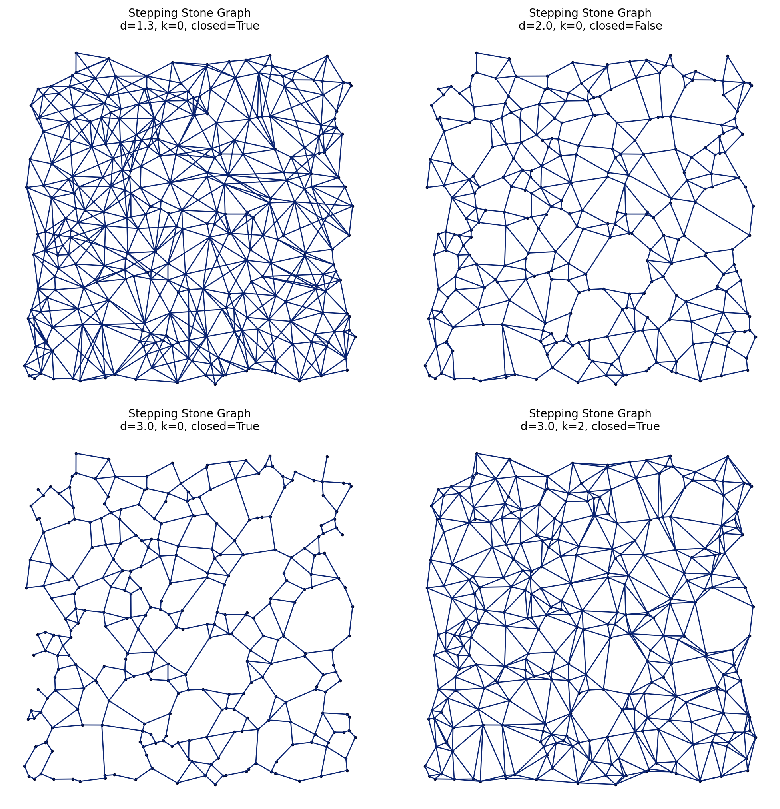

# Stepping_Stone

## Overview

`Stepping_Stone` implements a **d-diversion / stepping-stone proximity graph**: two points `p,q` are connected if a **super-elliptic lens neighborhood** around the segment `pq` contains at most `k` other sites.

This construction is useful when you want a **continuously-tunable “corridor” neighborhood** that interpolates between:
- a near-segment neighborhood (`d → 1⁺`), and
- a lens-like intersection of large balls (`d → ∞`).

## Figures

The examples below generate the same figures that are embedded here.




---

## Mathematical definition

### Notation

- Point set: `S = {p_1, …, p_n} ⊂ ℝ^D` (works in any dimension `D ≥ 1`).
- Norm: Euclidean `‖·‖`.
- Parameters:
  - `d ≥ 1` (real): shape exponent.
  - `k ∈ {0,1,2,…}`: allowed interior points (k-relaxation).
  - `closed ∈ {True, False}`: whether boundary counts as inside.

### Diversion neighborhood

For a pair `(p,q)`, define the **d-neighborhood**

```
N_d(p,q) = { x ∈ ℝ^D :  ‖x-p‖^d + ‖x-q‖^d  ≤  ‖p-q‖^d }      (closed=True)
N_d(p,q) = { x ∈ ℝ^D :  ‖x-p‖^d + ‖x-q‖^d  <  ‖p-q‖^d }      (closed=False)
```

and the point count

```
count_d(p,q) = | { x ∈ S\{p,q} : x ∈ N_d(p,q) } | .
```

### Edge rule (k-relaxed emptiness)

Include edge `(p,q)` iff `count_d(p,q) ≤ k`.

---

## Key identities and limiting cases

### Lemma 1 (d=2 reduces to the Gabriel disc)

Let `m = (p+q)/2` and `L = ‖p-q‖`. For any `x`,

1. Write `p = m - u`, `q = m + u` with `u = (q-p)/2` and `‖u‖ = L/2`.
2. Expand:

```
‖x-p‖^2 + ‖x-q‖^2
= ‖(x-m)+u‖^2 + ‖(x-m)-u‖^2
= 2‖x-m‖^2 + 2‖u‖^2
= 2‖x-m‖^2 + L^2/2 .
```

Thus the inequality `‖x-p‖^2 + ‖x-q‖^2 ≤ L^2` is equivalent to

```
‖x-m‖ ≤ L/2 ,
```

i.e. the **closed disc of radius L/2 centered at the midpoint** (the diametral disc used by the Gabriel graph).

### Lemma 2 (for d ≥ 2, N₂ ⊂ N_d)

Let `a=‖x-p‖`, `b=‖x-q‖`. In fixed dimension, `ℓ_p` norms satisfy
`(a^d+b^d)^{1/d} ≤ (a^2+b^2)^{1/2}` for `d ≥ 2`. Therefore

```
a^2 + b^2 ≤ L^2   ⇒   a^d + b^d ≤ L^d,
```

so `N_2(p,q) ⊂ N_d(p,q)`.

**Consequence:** if the larger neighborhood `N_d` is empty (k=0), then the Gabriel neighborhood is also empty; hence for `d ≥ 2` the stepping-stone graph is a subgraph of the Gabriel graph and (in nondegenerate cases) of the Delaunay triangulation.

### Limits

- `d → 1⁺`:
  - `‖x-p‖ + ‖x-q‖ ≤ ‖p-q‖` holds essentially only on the segment `[p,q]` by triangle inequality, so the neighborhood collapses to a “thin” set.
- `d → ∞`:
  - `‖x-p‖^d + ‖x-q‖^d ≤ L^d` approaches `max(‖x-p‖, ‖x-q‖) ≤ L`, i.e. `x` lies in **both** balls of radius `L` around `p` and `q` (a lens).

---

## Class definition

```python
class Stepping_Stone(ProximityGraph):
    def __init__(self, setpoints, d=2, k=0, closed=True):
        ...
```

### Parameters

- `setpoints : SetPoints`
  - The point set to connect.

- `d : float`, default `2`
  - Exponent controlling neighborhood “thickness”.
  - `d=2` reproduces the Gabriel disc neighborhood.
  - Larger `d` ⇒ larger neighborhood ⇒ typically sparser graphs (for k fixed).

- `k : int`, default `0`
  - Allowed number of other sites inside the neighborhood.

- `closed : bool`, default `True`
  - Boundary inclusion rule for the neighborhood test.

### Notes / recommended regimes

- Use `d ≥ 2` when you want Delaunay-based pruning to be safe (the implementation uses Delaunay candidates in this regime).
- Use `1 ≤ d < 2` when you explicitly want “thin corridor” behavior, but expect higher cost (more pairs checked).

---

## Algorithm (implementation-level)

1. Candidate edges:
   - If `d ≥ 2`, restrict to Delaunay edges (fast).
   - If `1 ≤ d < 2`, examine all pairs (exact but costly).

2. For each candidate edge `(i,j)`:
   - Compute `L = ‖p_i - p_j‖` and threshold `L^d`.
   - Count sites `x` with `‖x-p_i‖^d + ‖x-p_j‖^d ≤ L^d` (or `<`).
   - Keep edge if `count ≤ k`.

---

## Usage examples

### Reproducible example (saves the embedded figures)

```python
import matplotlib.pyplot as plt
import proximitygraphs as pg

# Points (unit square)
pts = pg.SetPoints.uniform_square(n=300, seed=11)
pts.draw(save="images/stepping_points", title=True, details=True)
plt.close("all")

# 2×2 grid over (d, k)
G1 = pg.Stepping_Stone(pts, d=1.3, k=0, closed=True)
G2 = pg.Stepping_Stone(pts, d=2.0, k=0, closed=False)
G3 = pg.Stepping_Stone(pts, d=3.0, k=0, closed=True)
G4 = pg.Stepping_Stone(pts, d=3.0, k=2, closed=True)
graphs = [G1, G2, G3, G4]

fig, _axs = pg.draw_grid(graphs, 2, 2, figsize=(10, 10), details=True)
fig.savefig("images/stepping_stone.png", dpi=200, bbox_inches="tight")
plt.close(fig)
```


---

## Performance characteristics

Let `n=|S|`, and `m_cand` be the candidate edge count (often `O(n)` for Delaunay in fixed dimension, `O(n^2)` for all pairs).

- **Time:** `O(m_cand · n)` for membership counting.
- **Space:** `O(n)` working memory for vectorized distance computations (plus storage for the graph).

---

## Related graphs (conceptual map)

- `d=2, k=0` aligns with the Gabriel neighborhood test (diametral disc).
- For `d ≥ 2`, inclusion `N_2 ⊂ N_d` implies `Stepping_Stone(d,k=0) ⊂ GG ⊂ DT` (nondegenerate).
- `k>0` produces a **robustified** proximity graph akin to “relative neighborhood with tolerance” / “k-nearest empty region” constructions.
