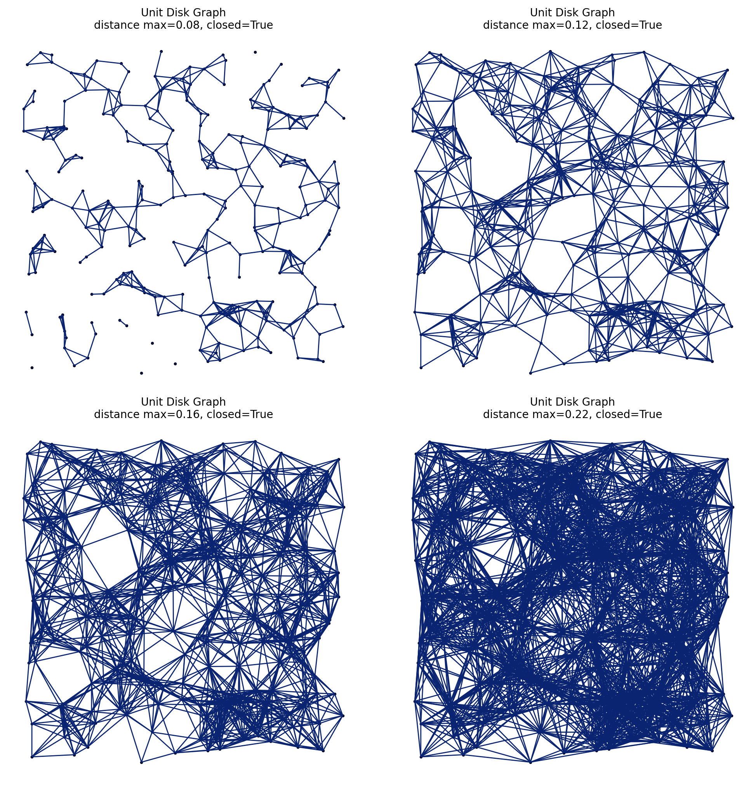

# Class: Unit_Disk

The Unit Disk Graph connects points within a specified distance.

## Constructor

```python
Unit_Disk(setpoints, dist_max, closed=True)
```

**Parameters:**
- **setpoints** (SetPoints): The set of points.
- **dist_max** (float): Maximum distance for connectivity (must be $\geq 0$).
- **closed** (bool): If True (default), uses $\leq$ dist_max. If False, uses $<$ dist_max.

## Mathematical Definition:

The Unit Disk Graph $\text{UDG}_r(P)$ with radius $r$ contains edge $(p, q)$ if and only if:

$$\|p - q\| \leq r \quad \text{(closed case)}$$
$$\|p - q\| < r \quad \text{(open case)}$$

The graph can be represented as:

$$\text{UDG}_r(P) = \{(p, q) \in P \times P : p \neq q, \|p - q\| \leq r\}$$

**Properties:**
- Models wireless communication networks (transmission range)
- Contains at most $\binom{n}{2}$ edges
- Connectivity threshold: $r_c \approx \sqrt{\frac{\log n}{\pi n}}$ for $n$ uniform points in unit square
- Can be computed in $O(n^2)$ time naively, or $O(n \log n + m)$ using spatial data structures

**Applications:**
- Wireless network modeling
- Geographic information systems (proximity analysis)
- Collision detection
- Range queries in databases

**Value Errors:**
- Raises `ValueError` if `dist_max < 0`
- Raises `TypeError` if `dist_max` is not numeric
- Raises `TypeError` if `closed` is not boolean

## Example

```python
from pathlib import Path
import proximitygraphs as pg

images = Path("images")
images.mkdir(parents=True, exist_ok=True)

pts = pg.SetPoints.uniform_square(n=250, seed=7)

# Save the point set used in the example
pts.draw(save=str(images / "unit_disk_points"), figsize=(6, 6), details=True)

G1 = pg.Unit_Disk(pts, dist_max=0.08, closed=True)
G2 = pg.Unit_Disk(pts, dist_max=0.12, closed=True)
G3 = pg.Unit_Disk(pts, dist_max=0.16, closed=True)
G4 = pg.Unit_Disk(pts, dist_max=0.22, closed=True)

graphs = [G1, G2, G3, G4]

fig, _axs = pg.draw_grid(graphs, 2, 2, figsize=(10, 10), details=True)
fig.savefig(images / "unit_disk.png", dpi=200, bbox_inches="tight")
```




